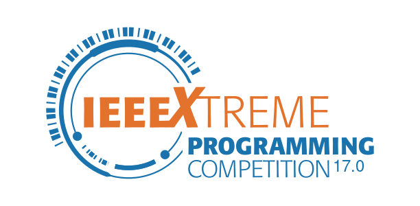

# IEEEXtreme17.0-solutions-repo

Welcome to the IEEEXtreme 17.0 Solutions Repository! This repository contains solutions to the problems presented during the IEEEXtreme 17.0 programming competition. We aim to provide a resource where participants can review, learn from, and discuss various approaches to solving these challenges.

## Structure:
Each problem has its dedicated folder containing solutions in various programming languages.
Solutions are organized by team or individual contributors, along with brief explanations or comments where necessary.
We encourage collaboration and constructive feedback. Feel free to submit pull requests if you have alternative solutions or improvements to existing ones.

## Contributions:
Ensure that your solutions are well-documented and adhere to best coding practices.
Before submitting, check if a solution for the particular problem already exists. You can still contribute by offering alternative solutions or optimizations if it does.
:star: Starring the repo is also a contribution!
Please consider contributing if your code is optimized or written in another language and you think it could help the Open Source Community. If you want to contribute and it's the first time you do, this tutorial, [First Contribution](https://github.com/firstcontributions/first-contributions), will help you!

Happy coding!